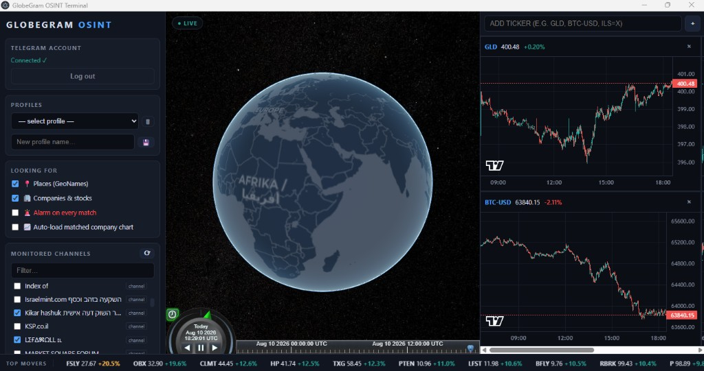

# GlobeGram OSINT — Real-Time Geo-Financial Intelligence Terminal

A desktop application that monitors your own Telegram channels/groups in real time,
recognizes **geographic locations** and **company names** in every message
(Hebrew, Arabic, English, Russian, Chinese, German), flies a 3D CesiumJS globe to
each event with auto-playing media popups, and synchronizes TradingView-style
candlestick charts + a top-market-movers tape bi-directionally with the globe's
timeline — live streaming or historical time-scrubbing to study how markets react
before and after an event.



100% free & open-source stack — no API keys, no tokens, no paid services:

| Layer | Technology |
|---|---|
| Desktop container | Electron (Node.js main process + Chromium renderer) |
| Telegram client | [GramJS](https://gram.js.org/) — MTProto personal-account client (Node equivalent of Telethon) |
| 3D globe | [CesiumJS](https://cesium.com/platform/cesiumjs/) + Carto dark basemap (offline Natural Earth fallback) |
| Financial charts | [TradingView Lightweight Charts](https://github.com/tradingview/lightweight-charts) |
| Market data | [yahoo-finance2](https://github.com/gadicc/yahoo-finance2) — 1-minute candles + day-gainers screener |
| Location engine | [GeoNames](https://www.geonames.org/) gazetteer (local, multilingual) |
| Company engine | Curated seed + [Wikidata](https://www.wikidata.org/) SPARQL (local, multilingual) |

---

## 🔐 Security model — nothing secret ever enters this repo

All credentials and runtime data live **outside** the project folder, in
`%LOCALAPPDATA%\globegram-terminal\`:

| File | Contents |
|---|---|
| `secrets.json` | `tg_api_id`, `tg_api_hash`, `tg_session` (Telegram login session) |
| `settings.json` | monitored channels, profiles, tickers (non-secret preferences) |
| `media\` | downloaded photos/videos |
| `gazetteer.json` / `companies.json` | locally built databases |

The `.gitignore` additionally blocks `secrets.json`, `*.session`, `.env*`, `*.db`,
media and data folders as a second safety net. **The repository is safe to clone,
fork, and publish — there is nothing to leak.** Secrets never cross into the
renderer process either (the IPC bridge exposes booleans only).

---

## 🚀 Quick start

**Requirements:** Windows / macOS / Linux with [Node.js](https://nodejs.org) ≥ 20.

Double-click **`run.bat`** (Windows — installs dependencies on first run, then
launches), or:

```bash
npm install
npm start
```

Want to see it working before connecting Telegram? Run the synthetic demo feed:

```bash
run.bat demo        # or:  GG_DEMO=1 npm start
```

Fake multilingual "breaking news" messages flow through the real pipeline — the
globe flies between events, popups open, chart markers appear.

---

## 📱 Connecting your Telegram account (one-time)

The app also shows this guide — click the **?** button in the *Telegram Account*
panel.

1. Open [my.telegram.org](https://my.telegram.org) and log in with your phone number.
2. Click **API development tools** and create an application (any name/short name).
3. Copy the **api_id** (numbers) and **api_hash** (long hex string).
4. Paste both into the app and press **Save credentials** — they are written to
   `%LOCALAPPDATA%`, never to the project folder.
5. Enter your phone number **with country code** (e.g. `+972501234567`) → **Send code**.
6. Telegram delivers a login code **inside your Telegram app** (not SMS) — enter it.
7. If your account uses two-step verification, enter your 2FA password when asked.

The session persists — subsequent launches connect automatically. The app uses your
own personal account and only reads channels/groups you already joined. **Log out**
wipes the stored session.

---

## 🖥️ Using the terminal

### Sidebar (left)
- **Telegram Account** — login state, guide, log out.
- **Profiles** — save your entire setup (selected channels + tickers + filters +
  alarm state) under a name; jump between saved profiles from the dropdown; 🗑 deletes.
- **Looking For** — what triggers globe events:
  - 📍 **Places** — GeoNames gazetteer matches.
  - 🏢 **Companies & stocks** — corporate entity matches (HQ coordinates + ticker).
  - 🚨 **Alarm on every match** — siren + desktop notification for every hit. Monitor
    a rocket-alert channel and this becomes a real-time missile-alarm terminal.
  - 📈 **Auto-load matched company chart** — mounts a matched company's 1-minute
    chart automatically.
- **Monitored Channels** — every channel/group your account joined; tick to monitor.
- **Event Feed** — live cards with keyword chips (red), place chips (blue) and company
  chips (gold). Click a card to fly to the event and open its popup (downloads the
  media on demand for low-priority messages).

### Globe (center)
- Events become time-tagged pins: red = high-priority place event, cyan = normal,
  gold = company HQ. A FIFO camera queue visits each event (4 s cadence; when more
  than 8 events are queued, flights shorten to 1 s and stay higher — burst mode).
- Popups show the message, auto-playing muted video/photo, and for company matches a
  corporate badge — `🏢 Name | TICKER | Country` — with a **Load chart** button.
- The Cesium clock/timeline at the bottom is the **master timeline**.

### Charts (right) + movers tape (bottom)
- Add any Yahoo Finance symbol: `GLD`, `USO`, `BTC-USD`, `ILS=X`, `^GSPC`, `ESLT`,
  `POLI.TA`… Default chart is **GLD**. Each chart shows 1-minute candles with event
  markers at the exact minute of each Telegram event.
- The bottom tape polls Yahoo's day-gainers screener; moves >20% are amber, >100%
  red. Click any symbol to chart it instantly.

### Bi-directional time sync
- **Globe → charts:** drag the Cesium timeline into the past — the charts load that
  day's 1-minute candles and a crosshair tracks the clock position.
- **Charts → globe:** click any candle — the globe clock jumps to that minute and
  only events "alive" at that moment remain visible.
- **GO LIVE** returns everything to real-time streaming.

---

## 🧠 How the recognition engines work

Every incoming message runs through two parallel local engines (no cloud calls):

1. **Keyword filter** — multilingual high-priority dictionary (explosion / missile /
   strike / sirens / earthquake / drone / interception… in en·he·ar·ru). A hit makes
   the event red and downloads its media immediately.
2. **Location engine** (`main/geocoder/`) — exact-match against a GeoNames index.
   Regex `\b` boundaries don't work for Hebrew/Arabic/CJK, so it uses a Unicode
   tokenizer with n-grams, strips Hebrew/Arabic proclitic prefixes
   (בבאר שבע → באר שבע, ورفح → رفح), undoes Russian case endings
   (в Москве → Москва), scans CJK by substring (北京), and resolves homonyms by
   population.
3. **Company engine** (`main/corporate/`) — same matcher over corporate aliases with
   a generic-word blocklist ("Inc", "Ltd", "בע״מ"…) and short all-caps ticker
   support (BP, GD, ZIM). Returns HQ coordinates, ticker, exchange, and country —
   e.g. *"explosion near the facility of **Intel** in **Kiryat Gat**"* pins both the
   city and the company.

### Databases (countries, cities, companies & stocks)

The repo ships **bundled world databases** so recognition works out of the box:

| DB | Size | Coverage |
|---|---|---|
| `main/geocoder/bundled-gazetteer.json` | ~24 MB | **~175,000** places — **all countries**, **all cities** (pop ≥ 1,000), **all admin1 regions** (states/provinces), Hebrew + English (+ ar/ru/zh/de) |
| `main/corporate/bundled-companies.json` | ~2 MB | **~8,700** public companies with HQ coordinates, tickers & aliases |

At runtime the app also merges a curated OSINT seed (EMCO, Elbit, Baykar, Tryavna, …).

To rebuild fresher copies from GeoNames + Wikidata (writes to `%LOCALAPPDATA%`, then
re-bundles into the repo):

```bash
npm run build-all
# equivalent to:
#   npm run build-gazetteer
#   npm run build-companies
#   npm run bundle-databases
```

---

## 📂 Project structure

```
├── run.bat                        # double-click launcher (run.bat demo = demo feed)
├── main/                          # Electron main process (Node.js)
│   ├── index.js                   # window + IPC hub + event pipeline
│   ├── preload.js                 # context-isolated bridge (no secrets cross it)
│   ├── paths.js / secureStore.js  # %LOCALAPPDATA% layout + secrets (outside repo)
│   ├── settings.js                # profiles, tickers, watch flags
│   ├── tdlib/                     # Telegram: auth state machine + chat manager
│   ├── geocoder/                  # GeoNames parser + seed gazetteer
│   ├── corporate/                 # company parser + seed companies
│   ├── financial/                 # Yahoo candles + top-movers scanner
│   └── utils/keywordFilter.js     # multilingual priority keywords
├── src/                           # renderer (Chromium)
│   ├── index.html / css/styles.css
│   └── js/
│       ├── app.js                 # controller: auth, feed, profiles, alarms
│       ├── globe/                 # cesiumManager + FIFO cameraQueue
│       ├── charts/chartManager.js # multi-chart grid + event markers
│       └── sync/timeSync.js       # globe ⇄ charts timeline sync
└── scripts/                       # gazetteer + company DB builders
```

---

## ⚠️ Notes & limits

- Yahoo caps 1-minute candles at ~30 days back; scrubbing further shows "no data"
  in the chart cell. Occasional `Too Many Requests` responses recover on their own.
- Map tiles need internet (Carto CDN); without it the globe falls back to bundled
  offline imagery.
- Windows renders flag emojis as letter pairs ("US") — OS font limitation; the
  country name is shown alongside.
- This tool reads only channels your own account already joined. Use responsibly
  and in accordance with Telegram's Terms of Service.

## License

MIT — see `package.json`. Data sources: GeoNames (CC-BY), Wikidata (CC0),
OpenStreetMap/Carto (ODbL / attribution).
